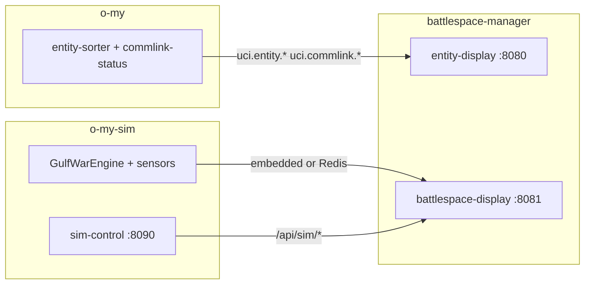

# battlespace-manager

**Operational web displays** for the Open Arsenal / OMS / UCI stack — extracted from [`o-my`](https://github.com/mowgli42/o-my) and [`o-my-sim`](https://github.com/mowgli42/o-my-sim). **Tested against o-my `0.2.0`** — see [`compat/tested-against.json`](compat/tested-against.json).

| Display | Role | Default ports |
|---------|------|---------------|
| **entity-display** | Production C2 map — ADS-B tracks, commlink overlays | UI `:8080`, API `:8003` |
| **battlespace-display** | Gulf War F2T2EA operator UI — kill chain, tasking, advisor | UI `:8081`, API `:8004` |

Simulation engines, sensors, and the sim-control panel remain in **o-my-sim**. Core C2 pipeline (entity-sorter, commlink-status, control plane) remains in **o-my**.

## Prerequisites

Clone all three repos as siblings:

```text
repo/
  o-my/
  o-my-sim/
  battlespace-manager/
```

```bash
python3 -m venv .venv
.venv/bin/pip install -e ../o-my/packages/uci_common -e ../o-my-sim/packages/uci_common fastapi uvicorn redis
```

## Quick start

### Entity display (C2 map)

Self-contained memory-bus demo (no Redis):

```bash
./scripts/run-entity-display-local.sh
# → http://127.0.0.1:8080
```

With full o-my Redis pipeline, start o-my core services first, then entity-display API from this repo.

### Battlespace display (Gulf War)

Embedded engine + API:

```bash
python3 scripts/run-battlespace-local.py
# API :8004

./scripts/run-battlespace-ui.sh
# UI  :8081
```

Sim engineers use **o-my-sim** sim-control panel (`:8090`) to drive the same API.

## Docker

Vendor sibling `uci_common` packages, then build:

```bash
./scripts/prepare-docker-vendor.sh
docker compose up --build
```

| URL | Service |
|-----|---------|
| http://localhost:8080 | Entity display web |
| http://localhost:8003/docs | Entity display API |
| http://localhost:8081 | Battlespace display web |
| http://localhost:8004/docs | Battlespace display API |

## Docs

- [O-MY walkthrough](docs/O-MY-WALKTHROUGH.md) — end-to-end tour with screenshots
- [Display metrics](docs/DISPLAY-METRICS.md) — header stats, F2T2EA phase rail, attention rail

Regenerate walkthrough screenshots:

```bash
./scripts/capture-o-my-walkthrough.sh
```

## Architecture


