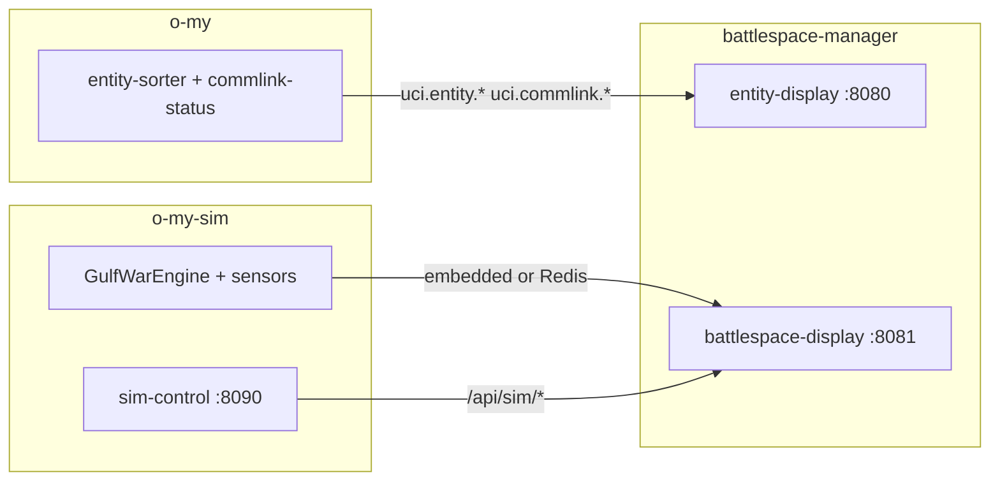

# battlespace-manager

**Operational web displays** for the Open Arsenal / OMS / UCI stack — extracted from [`o-my`](https://github.com/mowgli42/o-my) and [`o-my-sim`](https://github.com/mowgli42/o-my-sim). **Tested against o-my `0.2.0`** — see [`compat/tested-against.json`](compat/tested-against.json).

| Display | Role | Default ports |
|---------|------|---------------|
| **entity-display** | Production C2 map — ADS-B tracks, commlink overlays, affiliation filters, operator tagging | UI `:8080`, API `:8003` |
| **battlespace-display** | Gulf War F2T2EA operator UI — kill chain, tasking, advisor | UI `:8081`, API `:8004` |
| **rf-display** | RF spectrum / EMSO — commlinks, threat radars, EW jamming, EMCON deconfliction | UI `:8082`, API `:8005` |

Simulation engines, sensors, and the sim-control panel remain in **o-my-sim**. Core C2 pipeline (entity-sorter, commlink-status, control plane) remains in **o-my**.

## Tech stack

Tactical COP architecture is documented in [ADR 001 — tactical COP stack](docs/adr/001-tactical-cop-stack.md) (Grok review mapped to this repo; no greenfield Vue/MapLibre rewrite).

| Layer | battlespace-display | entity-display |
|-------|---------------------|----------------|
| **UI** | Svelte 5, Vite 6 | Svelte 5, Vite 6 |
| **Map** | Leaflet + **milsymbol** (MIL-STD-2525D) | Leaflet |
| **Picture transport** | SSE `GET /api/stream` + snapshot `GET /api/picture` | SSE + REST |
| **API** | FastAPI, uvicorn | FastAPI, uvicorn, Redis |
| **Scenario / tracks** | Embedded or Redis `GulfWarEngine` (`o-my-sim`) | o-my pipeline (`uci.entity.*`, commlinks) |
| **Contracts** | Zod `Track` model, `picture_contract.py` | UCI XML → categorized entities |
| **Tests** | vitest (web), Python unittest (API) | vitest, Python unittest |

**Shared conventions:** UCI message contracts via `uci_common`, compat banner (`compat/tested-against.json`), CARTO dark basemap tiles.

**Implemented (COP phases 0–1):** typed track model, picture JSON contract, MIL-STD-2525D map markers, unified timeline tab, attention rail + F2T2EA phase filter.

**Planned (later phases):** IndexedDB last-picture cache (Phase 5), clearance/RBAC mock (Phase 6), MapLibre spike for 500+ tracks (Phase 9). WebSocket and full Dexie offline sync are explicitly out of scope for the current stack.

## Prerequisites

Clone all three repos as siblings:

```text
repo/
  o-my/
  o-my-sim/
  battlespace-manager/
```

```bash
python3 -m venv .venv
.venv/bin/pip install -e ../o-my/packages/uci_common -e ../o-my-sim/packages/uci_common fastapi uvicorn redis
```

## Quick start

### Entity display (C2 map)

Self-contained memory-bus demo (no Redis):

```bash
./scripts/run-entity-display-local.sh
# → http://127.0.0.1:8080
```

With full o-my Redis pipeline, start o-my core services first, then entity-display API from this repo.

### Battlespace display (Gulf War)

Embedded engine + API:

```bash
python3 scripts/run-battlespace-local.py
# API :8004

./scripts/run-battlespace-ui.sh
# UI  :8081
```

Sim engineers use **o-my-sim** sim-control panel (`:8090`) to drive the same API.

## Docker

Vendor sibling `uci_common` packages, then build:

```bash
./scripts/prepare-docker-vendor.sh
docker compose up --build
```

| URL | Service |
|-----|---------|
| http://localhost:8888 | **Display portal** — all displays + OMS monitoring status |
| http://localhost:8080/landing | Entity display landing (same portal, current display highlighted) |
| http://localhost:8080 | Entity display web |
| http://localhost:8003 | Entity display API (also `/landing`, `/api/portal/status`) |
| http://localhost:8081/landing | Battlespace display landing |
| http://localhost:8081 | Battlespace display web |
| http://localhost:8004 | Battlespace display API |
| http://localhost:8082/landing | RF display landing |
| http://localhost:8082 | RF display web |
| http://localhost:8005 | RF display API |
| http://localhost:9090 | Prometheus (o-my `--profile monitoring`) |
| http://localhost:3000 | Grafana dashboards (`admin` / `admin`) |

## Docs

- [ADR 001 — tactical COP stack](docs/adr/001-tactical-cop-stack.md) — Svelte + Leaflet + SSE vs Grok greenfield
- [COP operator workflow](docs/COP-OPERATOR-WORKFLOW.md) — nominal F2T2EA flow with screenshots (review deck)
- [O-MY walkthrough](docs/O-MY-WALKTHROUGH.md) — end-to-end tour with screenshots
- [Display metrics](docs/DISPLAY-METRICS.md) — header stats, F2T2EA phase rail, attention rail
- [RF display design](docs/RF-DISPLAY-DESIGN.md) — EMSO deconfliction research and rf-display architecture
- [RF display walkthrough](docs/RF-DISPLAY-WALKTHROUGH.md) — operator EMSO workflow with screenshots

Regenerate battlespace workflow screenshots:

```bash
./scripts/demo-presentation.sh
```

Regenerate walkthrough screenshots:

```bash
./scripts/capture-o-my-walkthrough.sh
```

## Testing

Run **all** display unit tests (entity-display + battlespace-display, API + vitest + build):

```bash
./scripts/run-all-tests.sh
```

Verify CAOC tasking queue at T+0 (OMS platforms + ATO tasks) and capture proof screenshot:

```bash
./scripts/capture-tasking-t0.sh
# → docs/images/tasking-queue-t0-fix.png
```

Repo ownership and decoupling rules: [ADR 002](docs/adr/002-repo-boundaries.md).

## Architecture


