# battlespace-manager

**Operational web displays** for the Open Arsenal / OMS / UCI stack — extracted from [`o-my`](https://github.com/mowgli42/o-my) and [`o-my-sim`](https://github.com/mowgli42/o-my-sim). **Tested against o-my `0.2.0`** — see [`compat/tested-against.json`](compat/tested-against.json).

**Vercel previews:** battlespace-display harness deploys from this public repo with private `uci_common` vendored at build time — see [`DEPLOYMENT.md`](DEPLOYMENT.md).

| Display | Role | Default ports |
|---------|------|---------------|
| **entity-display** | Production C2 map — ADS-B tracks, commlink overlays, affiliation filters, operator tagging | UI `:8930`, API `:8030` |
| **battlespace-display** | Gulf War F2T2EA operator UI — kill chain, tasking, advisor | UI `:8931`, API `:8031` |
| **rf-display** | RF spectrum / EMSO — commlinks, threat radars, EW jamming, EMCON deconfliction | UI `:8932`, API `:8032` |

Simulation engines, sensors, and the sim-control panel remain in **o-my-sim** (sim-control → **scenario-director :8270**, not embedded GulfWarEngine). Core C2 pipeline (entity-fusion, entity-sorter, commlink-status, control plane) remains in **o-my**.

**Cross-stack displays:** with o-my processors + o-my-sim publishers running, start displays against shared Redis:

```bash
cd ../o-my && ./scripts/run-cross-stack-compose.sh -d
cd ../o-my && ./scripts/run-cross-stack-displays.sh
# or: REDIS_URL=redis://127.0.0.1:6379/0 ./scripts/run-battlespace-bus.sh
```

## Operator displays

Start the **display portal** (see [Quick start](#display-portal)) or any API `/landing` page to see live status for all displays and OMS monitoring (Prometheus `:8109`, Grafana `:8900`).

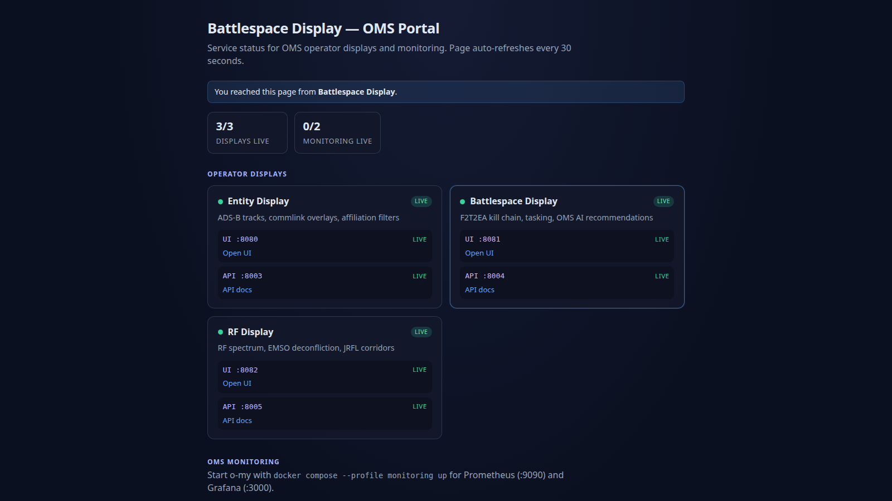

| Display | Screenshot | Harness |
|---------|------------|---------|
| Entity (C2 map + fog/route overlays) | 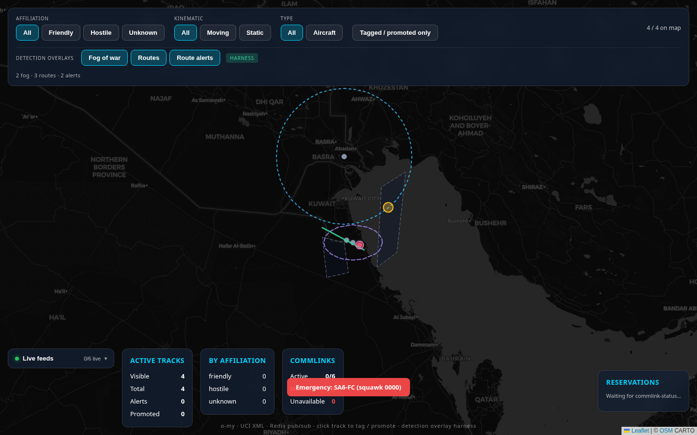 | `ENTITY_HARNESS=1` |
| Battlespace (F2T2EA tasking + kill chain) | 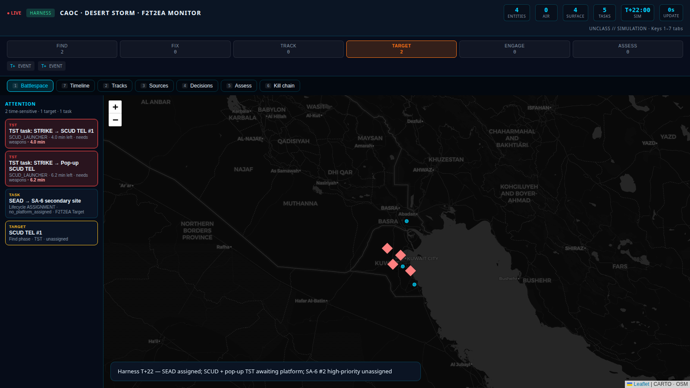 | `BATTLESPACE_HARNESS=1` |
| RF spectrum (EMSO deconfliction) | 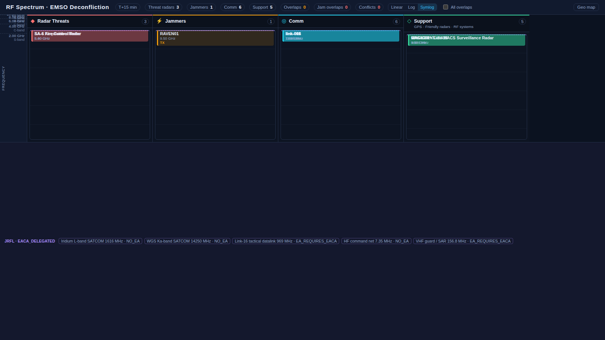 | `RF_HARNESS=1` |

Entity chrome: top bar holds **Feeds** (click for active feed list), track filters, and map **Layers** (Fog / Routes / Alerts). Commlink **link reservations** (spectrum/SATCOM holds from `uci.commlink.reservation`) live under the Commlinks card — not the mission ATO schedule.

### Route threats & popup tasking

Bus / harness picture now includes `route_threats` and Attention Rail **POPUP** cues from `uci.route.threat` / `uci.threat.notification` (o-my `popup-tasker` + `threat-notifier`).

| View | Screenshot |
|------|------------|
| Attention rail (POPUP + TST) | 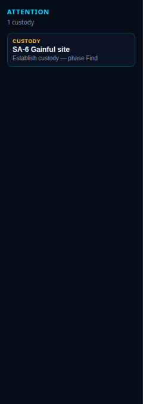 |
| Impacted routes (Strike/EJ/Jam bands) | 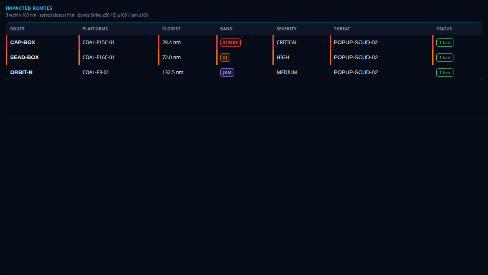 |
| Routes tab (full shell) | 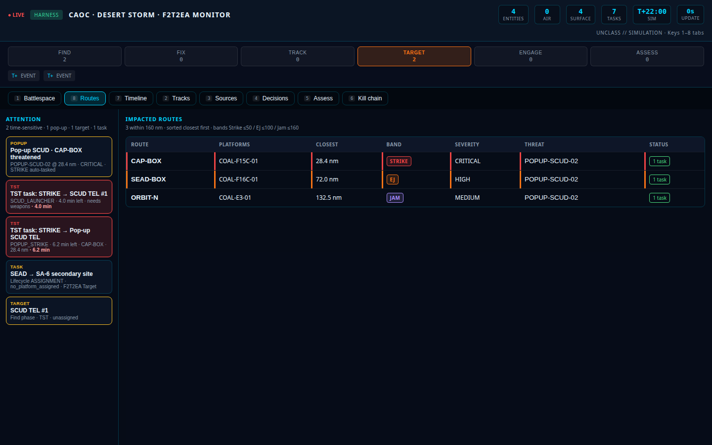 |
| Map + segment timeline | 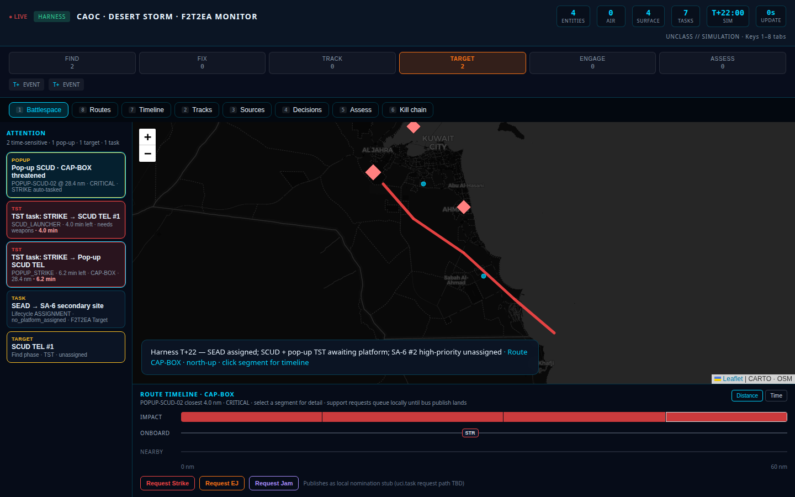 |
| CAOC tasking (popup bands) | 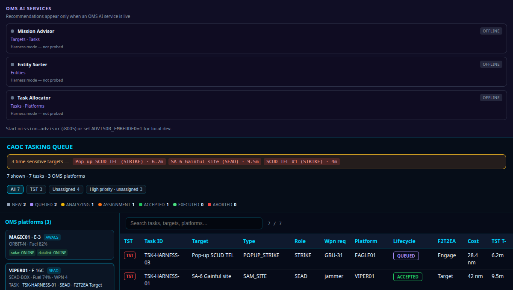 |

```bash
# Harness API :8031 + UI :8931, then:
python3 scripts/capture-route-threat-screenshots.py http://127.0.0.1:8931

### Timeline and F2T2EA (battlespace-display)

| Tab | Operator behavior |
|-----|-------------------|
| **Timeline** | One lane per aircraft, aligned to sim time (same idea as o-my-mission-plan). Playhead at **25%** of the window, **75%** upcoming. Zoom **10 min / 30 min / 1 h / 3 h / 6 h / 12 h**. Glyphs from o-my-debrief: ⚑ TOT · ◆ ETA · ▼ event · ● task. The task list is empty until an aircraft is selected; **Details** opens Kill chain with that task; the lane header shows the aircraft route on the map. |
| **Kill chain** | F2T2EA **kanban** (Find → Assess — no All). Select a card for right-pane details and static Map / EO / IR / SAR frames. Drag a card (or **Assign platform**) to **Decisions**, where the task is pinned at the top for platform assignment. |
| **Sources** | Fusion `:8000` and sorter `:8001` plus other processors from `uci.service.status` (not hardcoded empty rows). |
```

Regenerate screenshots (starts harness-mode stack, captures Playwright shots):

```bash
./scripts/capture-display-screenshots.sh
# → docs/images/displays/*.png
```

## Tech stack

Tactical COP architecture is documented in [ADR 001 — tactical COP stack](docs/adr/001-tactical-cop-stack.md) (Grok review mapped to this repo; no greenfield Vue/MapLibre rewrite).

| Layer | battlespace-display | entity-display |
|-------|---------------------|----------------|
| **UI** | Svelte 5, Vite 6 | Svelte 5, Vite 6 |
| **Map** | Leaflet + **milsymbol** (MIL-STD-2525D) | Leaflet |
| **Picture transport** | SSE `GET /api/stream` + snapshot `GET /api/picture` | SSE + REST |
| **API** | FastAPI, uvicorn | FastAPI, uvicorn, Redis |
| **Scenario / tracks** | `BUS_PICTURE_MODE` bus subscriber or embedded `GulfWarEngine` (harness) | o-my fusion path (`uci.correlated.entity`, `uci.entity.*`) |
| **Contracts** | Zod `Track` model, `picture_contract.py` | UCI XML → categorized entities |
| **Tests** | vitest (web), Python unittest (API) | vitest, Python unittest |

**Shared conventions:** UCI message contracts via `uci_common`, compat banner (`compat/tested-against.json`), CARTO dark basemap tiles.

**Implemented (COP phases 0–4):** typed track model, picture JSON contract, MIL-STD-2525D map markers, aligned per-aircraft timeline (25% elapsed / 75% upcoming, zoom 10 min–12 h), F2T2EA **kanban** (assign via Decisions), static task imagery (Map / EO / IR / SAR), attention rail + Sources from `uci.service.status`.

**Planned (later phases):** IndexedDB last-picture cache (Phase 5), clearance/RBAC mock (Phase 6), MapLibre spike for 500+ tracks (Phase 9). WebSocket and full Dexie offline sync are explicitly out of scope for the current stack.

## Prerequisites

Clone all three repos as siblings:

```text
repo/
  o-my/
  o-my-sim/
  battlespace-manager/
```

```bash
python3 -m venv .venv
.venv/bin/pip install -e ../o-my/packages/uci_common -e ../o-my-sim/packages/uci_common fastapi uvicorn redis
```

## Quick start

### Entity display (C2 map)

Self-contained memory-bus demo (no Redis):

```bash
./scripts/run-entity-display-local.sh
# → http://127.0.0.1:8930
```

With full o-my Redis pipeline, start o-my core services first, then entity-display API from this repo.

### Battlespace display (Gulf War)

**Harness / demo** (embedded engine):

```bash
python3 scripts/run-battlespace-local.py
# API :8031

./scripts/run-battlespace-ui.sh
# UI  :8931
```

**Cross-stack / bus picture mode** (no GulfWarEngine truth — recommended with o-my processors):

```bash
export REDIS_URL=redis://127.0.0.1:6379/0
export BUS_PICTURE_MODE=1
./scripts/run-battlespace-bus.sh
# UI :8931 · API :8031 · COP from uci.correlated.entity, uci.oms.state,
# uci.f2t2ea.state, uci.route.threat, uci.threat.notification, uci.task,
# uci.agent.suggestion, uci.service.status
```

Sim engineers use **o-my-sim** sim-control panel (`:8970`) against **scenario-director** (`:8270`).

### RF spectrum (EMSO deconfliction)

**Harness / demo** (deterministic sample spectrum — recommended for first look):

```bash
python3 scripts/run-rf-display-harness.py
# API :8032 · verify: http://127.0.0.1:8032/api/harness/verify

./scripts/run-rf-display-ui.sh
# UI  :8932
```

**Live Gulf War engine** (embedded sim + commlink overlay):

```bash
python3 scripts/run-rf-display-local.py
./scripts/run-rf-display-ui.sh
```

Walkthrough and design notes: [RF display walkthrough](docs/RF-DISPLAY-WALKTHROUGH.md), [RF display design](docs/RF-DISPLAY-DESIGN.md).

### Display portal

Status landing for all three displays plus Prometheus/Grafana probes:

```bash
python3 scripts/run-display-portal.py
# → http://127.0.0.1:8939
```

Portal rows stay `offline` / `degraded` until the matching UI/API processes (or Docker services) are up. With Redis available it also prefers `uci.service.status` from the o-my bus; without Redis it falls back to HTTP `/health` probes.

## Docker

Vendor sibling `uci_common` packages, then build:

```bash
./scripts/prepare-docker-vendor.sh
docker compose up --build
```

| URL | Service |
|-----|---------|
| http://localhost:8939 | **Display portal** — all displays + OMS monitoring status |
| http://localhost:8930/landing | Entity display landing (same portal, current display highlighted) |
| http://localhost:8930 | Entity display web |
| http://localhost:8030 | Entity display API (also `/landing`, `/api/portal/status`) |
| http://localhost:8931/landing | Battlespace display landing |
| http://localhost:8931 | Battlespace display web |
| http://localhost:8031 | Battlespace display API |
| http://localhost:8932/landing | RF display landing |
| http://localhost:8932 | RF display web |
| http://localhost:8032 | RF display API |
| http://localhost:8109 | Prometheus (o-my `--profile monitoring`) |
| http://localhost:8900 | Grafana dashboards (`admin` / `admin`) |

## Docs

- [OpenSpec](docs/OPENSPEC.md) — living architecture/capability index (surfaces, contracts, harness vs bus, phases)
- [ADR 001 — tactical COP stack](docs/adr/001-tactical-cop-stack.md) — Svelte + Leaflet + SSE vs Grok greenfield
- [COP operator workflow](docs/COP-OPERATOR-WORKFLOW.md) — nominal F2T2EA flow with screenshots (review deck)
- [O-MY walkthrough](docs/O-MY-WALKTHROUGH.md) — end-to-end tour with screenshots
- [Display metrics](docs/DISPLAY-METRICS.md) — header stats, F2T2EA phase counts, attention rail
- [RF display design](docs/RF-DISPLAY-DESIGN.md) — EMSO deconfliction research and rf-display architecture
- [RF display walkthrough](docs/RF-DISPLAY-WALKTHROUGH.md) — operator EMSO workflow with screenshots

Regenerate battlespace workflow screenshots:

```bash
./scripts/demo-presentation.sh
```

Regenerate walkthrough screenshots:

```bash
./scripts/capture-o-my-walkthrough.sh
```

## Testing

Run **all** display unit tests (entity-display + battlespace-display, API + vitest + build):

```bash
./scripts/run-all-tests.sh
```

Operator happy-path Gherkin (harness mode) lives under [`features/`](features/) and is kept aligned with each display’s harness feature checks via `scripts/check-gherkin-alignment.py`.

Verify CAOC tasking queue at T+0 (OMS platforms + ATO tasks) and capture proof screenshot:

```bash
./scripts/capture-tasking-t0.sh
# → docs/images/tasking-queue-t0-fix.png
```

Repo ownership and decoupling rules: [ADR 002](docs/adr/002-repo-boundaries.md).

## Architecture

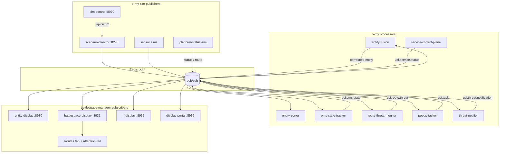
```mermaid
flowchart TB
  subgraph omy [o-my processors]
    FUSE[entity-fusion]
    SORT[entity-sorter]
    OMS[oms-state-tracker]
    RTM[route-threat-monitor]
    POP[popup-tasker]
    NOTE[threat-notifier]
    CP[service-control-plane]
  end
  subgraph omysim [o-my-sim publishers]
    SD[scenario-director :8270]
    SNS[sensor sims]
    PLAT[platform-status-sim]
    SimCtrl[sim-control :8970]
  end
  subgraph bus [Redis uci.*]
    REDIS[(pub/sub)]
  end
  subgraph bm [battlespace-manager subscribers]
    ED[entity-display :8930]
    BD[battlespace-display :8931]
    RF[rf-display :8932]
    ROUTES[Routes tab + Attention rail]
    PORTAL[display-portal :8939]
  end
  SimCtrl -->|/api/sim/*| SD
  SD --> REDIS
  SNS --> REDIS
  PLAT -->|status / route| REDIS
  REDIS --> FUSE
  FUSE -->|correlated.entity| REDIS
  REDIS --> SORT
  REDIS --> OMS
  OMS -->|uci.oms.state| REDIS
  REDIS --> RTM
  RTM -->|uci.route.threat| REDIS
  REDIS --> POP
  POP -->|uci.task| REDIS
  REDIS --> NOTE
  NOTE -->|uci.threat.notification| REDIS
  CP -->|uci.service.status| REDIS
  REDIS --> ED
  REDIS --> BD
  REDIS --> RF
  BD --> ROUTES
  REDIS --> PORTAL
```

| Mode | entity-display | battlespace-display | rf-display | Service health |
|------|----------------|---------------------|------------|----------------|
| Harness | `ENTITY_HARNESS=1` | `BATTLESPACE_HARNESS=1` | `RF_HARNESS=1` | HTTP `/health` probes |
| Cross-stack bus | `REDIS_URL` + fusion topics | `BUS_PICTURE_MODE=1` (+ `uci.oms.state`, `uci.f2t2ea.state`, `uci.route.threat`, `uci.threat.notification`, `uci.task`) | Redis + EMSO topics / fixtures | `uci.service.status` preferred |

Legacy embedded path (deprecated for cross-stack):

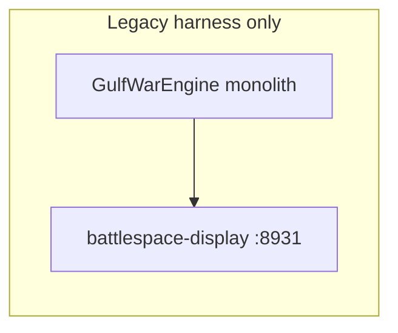
```mermaid
flowchart LR
  subgraph legacy [Legacy harness only]
    Engine[GulfWarEngine monolith]
    BD2[battlespace-display :8931]
  end
  Engine --> BD2
```

## Sequence — picture update and popup tasking

Primary operator flows: bus/harness picture over SSE, then attention-rail tasking. Walkthrough screenshots: [docs/images/walkthrough/](docs/images/walkthrough/).

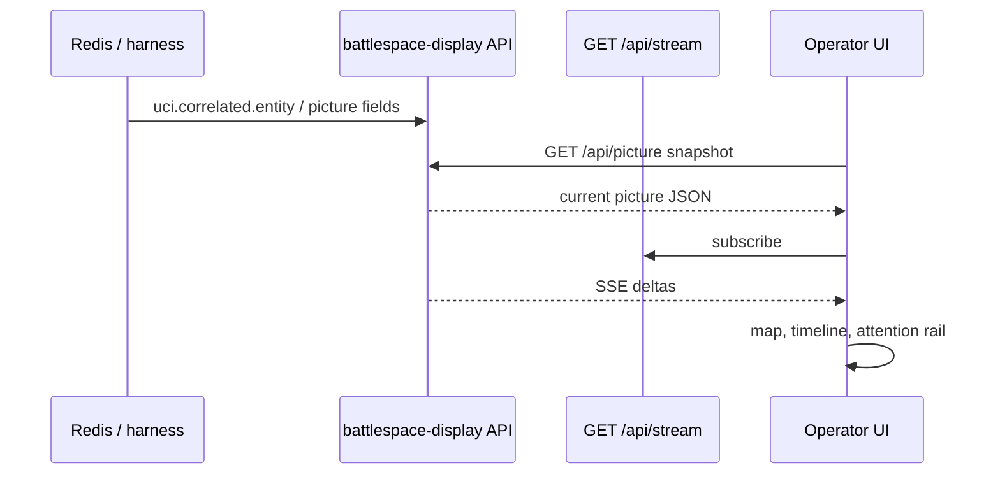
```mermaid
sequenceDiagram
  participant Bus as Redis / harness
  participant API as battlespace-display API
  participant SSE as GET /api/stream
  participant UI as Operator UI

  Bus->>API: uci.correlated.entity / picture fields
  UI->>API: GET /api/picture snapshot
  API-->>UI: current picture JSON
  UI->>SSE: subscribe
  API-->>UI: SSE deltas
  UI->>UI: map, timeline, attention rail
```

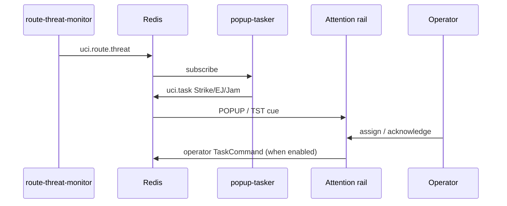
```mermaid
sequenceDiagram
  participant RTM as route-threat-monitor
  participant Bus as Redis
  participant Pop as popup-tasker
  participant UI as Attention rail
  participant Op as Operator

  RTM->>Bus: uci.route.threat
  Bus->>Pop: subscribe
  Pop->>Bus: uci.task Strike/EJ/Jam
  Bus->>UI: POPUP / TST cue
  Op->>UI: assign / acknowledge
  UI->>Bus: operator TaskCommand (when enabled)
```
