# COP operator workflow — battlespace display

Nominal **CAOC F2T2EA monitor** flow for the Gulf War simulation, with screenshots captured from live test data (`gulf_war_1991.json`). Use this deck for design reviews and stakeholder walkthroughs.

Regenerate images:

```bash
./scripts/demo-presentation.sh
# → docs/images/presentation/workflow/
```

Live demo after capture: http://127.0.0.1:8081 (API `:8004`).

---

## Workflow at a glance

```mermaid
flowchart LR
  A[1. HUD overview] --> B[2. Battlespace map]
  B --> C[3. Mission timeline]
  C --> D[4. Feed health]
  D --> E[5. Track registry]
  E --> F[6. Attention / TST]
  F --> G[7. Kill chain]
  G --> H[8. Tasking / Decisions]
  H --> I[9. Timeline — SCUD]
  I --> J[10. Strike queue]
  J --> K[11. BDA / Assess]
```

| Step | Sim time | Tab | Operator intent |
|------|----------|-----|-----------------|
| 1 | T+0 | (shell) | Orient — picture health, phase distribution, attention queue |
| 2 | T+12 | Battlespace | Situational awareness — MIL-STD-2525D tracks + SIGINT cue |
| 3 | T+0 | Timeline | Plan ahead — scenario beats and open tasks on one axis |
| 4 | T+10 | Sources | Verify feeds — fusion rows, correlation, feed latency |
| 5 | T+15 | Tracks | Custody — entity registry, confidence, domain |
| 6 | T+22 | Battlespace | React — SCUD launch promotes TST on attention rail |
| 7 | T+15 | Kill chain | Targeting — SA-6 HVT in **Find** after ELINT/MTI |
| 8 | T+20 | Decisions | Task — SEAD queue against located SAM site |
| 9 | T+22 | Timeline | Coordinate — imminent SCUD beat + strike tasks |
| 10 | T+25 | Decisions | Commit — strike assignment after IMINT fix |
| 11 | T+50 | Assess | Close loop — BDA on destroyed TEL |

Keyboard shortcuts: **1** Battlespace · **7** Timeline · **2** Tracks · **3** Sources · **4** Decisions · **5** Assess · **6** Kill chain.

---

## 1 — Orient on the HUD

At H-hour the operator confirms the picture is live before drilling into threats.

**Header stats** — entity count, air/surface threats, open tasks, sim clock, SSE update latency. See [Display metrics](DISPLAY-METRICS.md) for field mapping.

**F2T2EA phase rail** — kill-chain counts per phase; click a phase to filter the Kill chain tab.

**Attention rail** — TST, pop-up, target, task, and advisor items sorted by urgency.

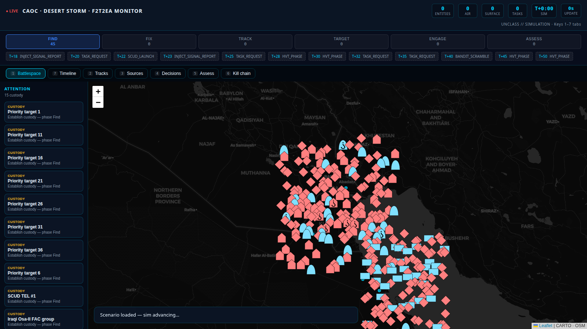

Component close-ups: [`metrics/`](images/presentation/metrics/) (stat cards, phase rail, attention rail).

---

## 2 — Battlespace situational awareness

After the SAT SIGINT cue at **T+12**, the map shows correlated OPFOR and coalition tracks with **milsymbol** icons (affiliation × domain). Cue ellipses highlight SIGINT/IMINT reports.

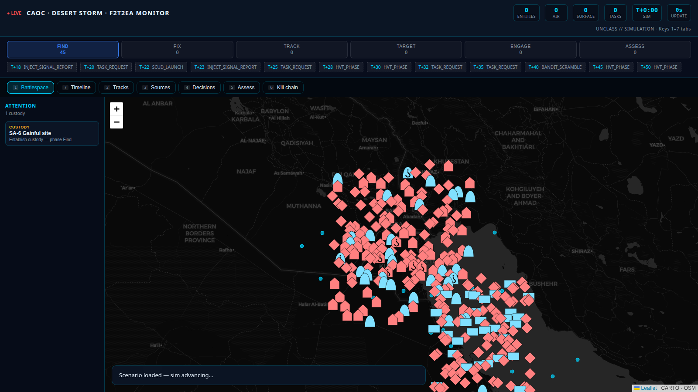

Click a track for affiliation, platform type, confidence, and F2T2EA phase:

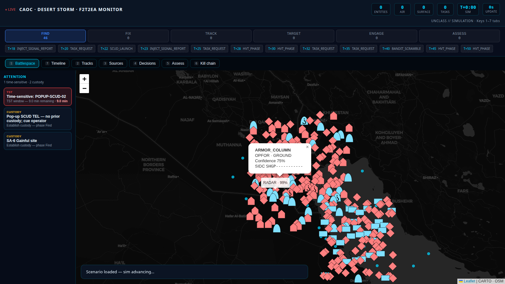

---

## 3 — Mission timeline (plan)

The **Timeline** tab merges scenario beats from `gulf_war_1991.json` with open CAOC tasks on a single horizon. Filters: All · Upcoming · Scenario · Tasks.

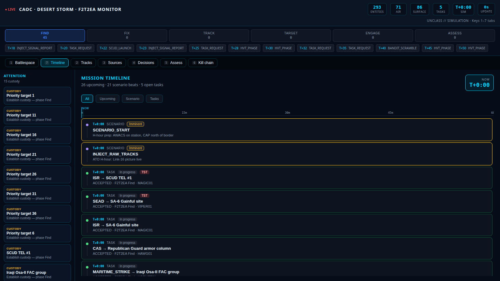

Scenario-only view before SCUD/SEAD beats fire:

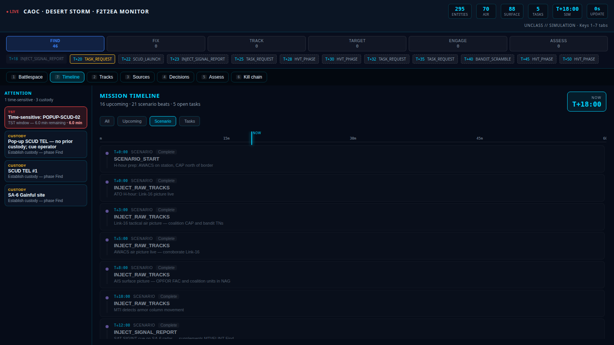

---

## 4 — Feed fusion health

At **T+10** MTI, Link-16, AWACS, and AIS feeds are online. Operators verify correlation rows and stale-track flags before trusting custody.

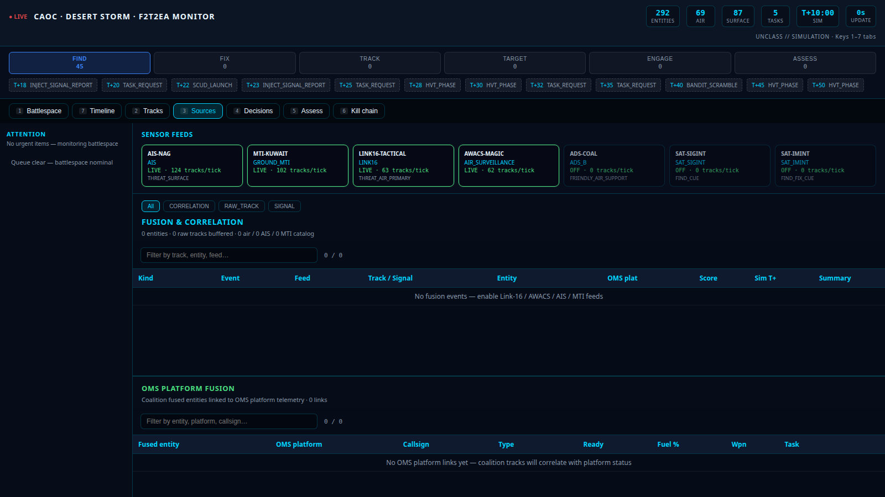

---

## 5 — Track registry

The **Tracks** tab is the authoritative entity list — domain, affiliation, confidence, kill-chain phase, and stale indicators.

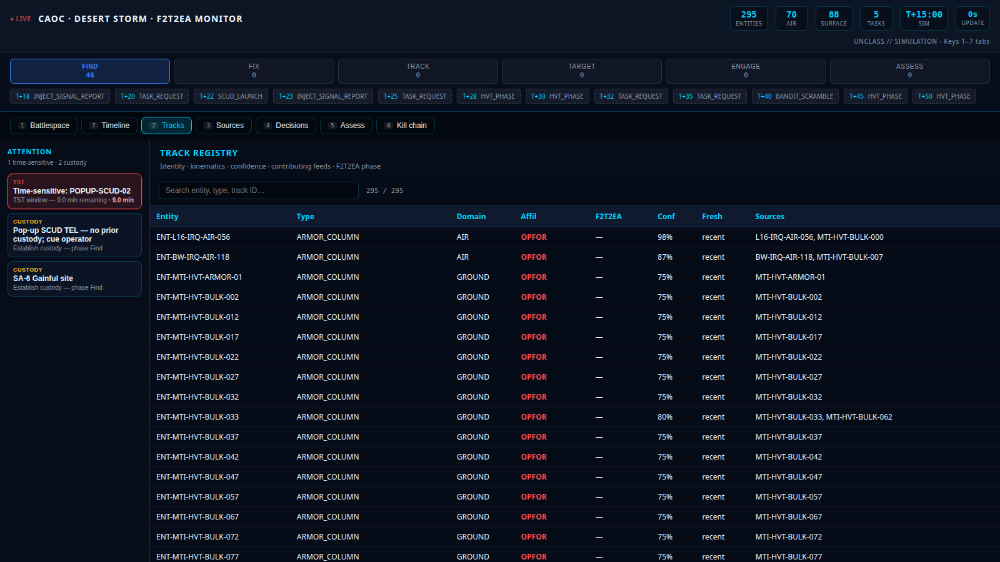

---

## 6 — Attention queue / time-sensitive target

**T+22 SCUD launch** promotes a time-sensitive item on the attention rail. Clicking routes to Decisions or pans the map to the entity.

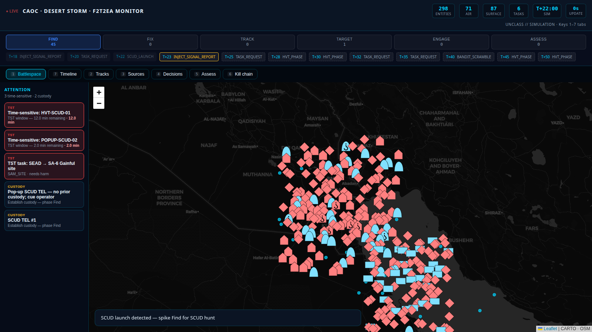

---

## 7 — Kill chain (Find)

The SA-6 HVT transitions to **Find** at T+15 after ELINT and MTI cues. FKCM rows show phase, custody flags, and tasking state.

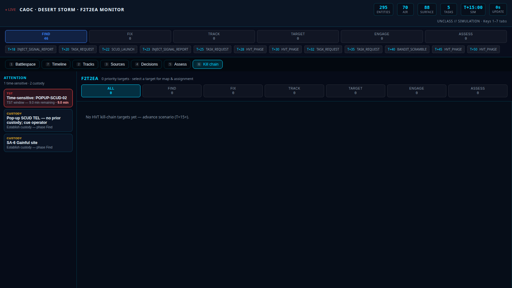

Selecting a target row highlights map correlation and task history:


---

## 8 — CAOC tasking (SEAD)

At **T+20** the engine requests SEAD against the located SAM site. The **Decisions** tab shows lifecycle state, blocking reasons, platform assignment, and advisor suggestions.

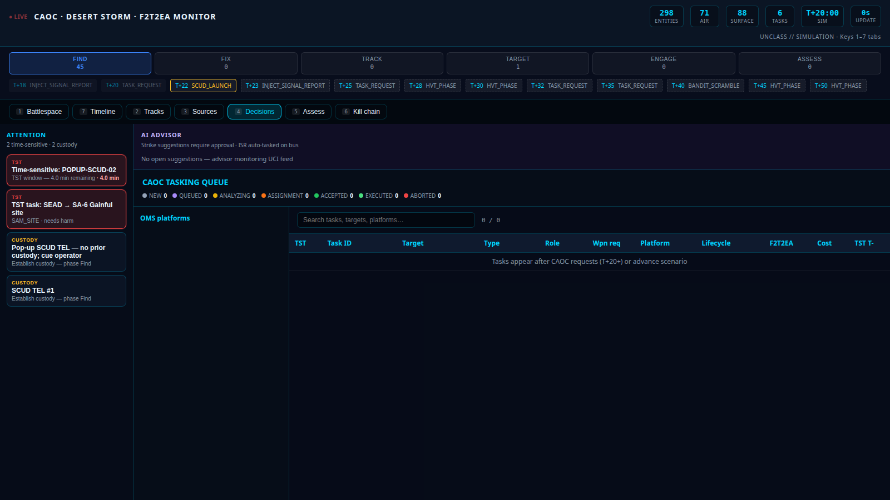

---

## 9 — Timeline at SCUD launch

At **T+22** the scenario beat is **imminent**; strike tasks appear as open items on the same axis as feed injections and HVT phase changes.

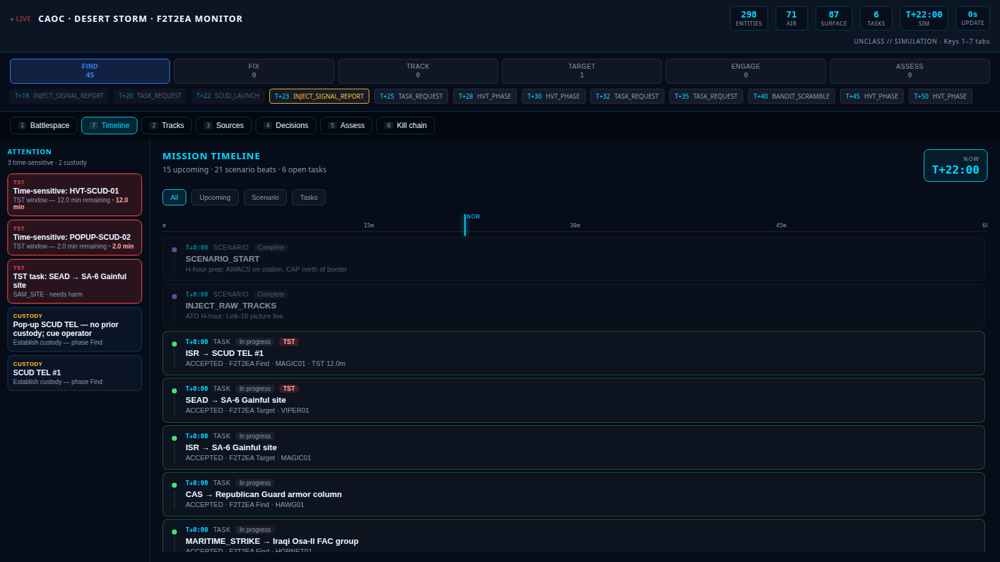

---

## 10 — Strike tasking

After post-launch IMINT at T+23 and strike request at T+25, the Decisions queue shows the SCUD TEL assignment.

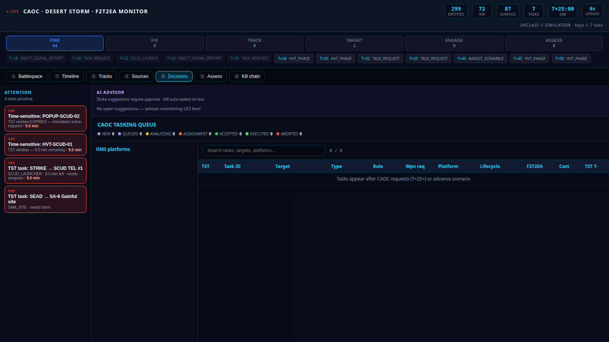

---

## 11 — Assess / BDA

At **T+50** the SCUD HVT reaches **Assess** with simulated BDA — TEL destroyed. Operators confirm effects before re-tasking.

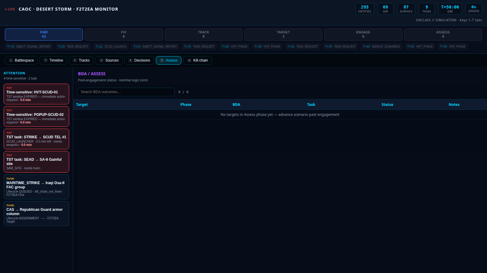

---

## Implementation status (COP phases)

| Phase | Capability | Workflow step |
|-------|------------|---------------|
| 0 | Track model + picture contract | All tabs |
| 1 | MIL-STD-2525D milsymbol map | Step 2 |
| 2 | SSE `/api/stream` hot path | HUD Update stat (step 1) |
| 3 | Unified timeline view | Steps 3, 9 |
| 4 | Attention rail + tasking | Steps 6, 8, 10 |
| 5+ | Offline cache, geofence TST | Planned |

Stack decisions: [ADR 001 — tactical COP stack](adr/001-tactical-cop-stack.md).

---

## Related docs

- [Display metrics](DISPLAY-METRICS.md) — header stats and rail field reference
- [O-MY walkthrough](O-MY-WALKTHROUGH.md) — full stack from commlink through sim
- [Grok consultation queue](grok-questions.md) — open design questions for sample code
