# O-MY stack walkthrough

End-to-end tour of the **o-my** base services and **o-my-sim** Gulf War simulation, including how commlink status flows from the base platform into simulated OMS platform telemetry.

Captured screenshots live in [`docs/images/walkthrough/`](images/walkthrough/). Regenerate with:

```bash
./scripts/capture-o-my-walkthrough.sh
```

---

## Architecture at a glance

```text
Commlink-Directory XML v1.1
        │
        ▼
┌───────────────────┐     uci.commlink.*      ┌────────────────────────┐
│  o-my             │ ───────────────────────►│  o-my-sim              │
│  commlink-status  │     inventory/status/   │  platform-status-sim   │
│  ads-b-sensor     │     reservation           │  task-allocator        │
└─────────┬─────────┘                         └───────────┬────────────┘
          │                                               │
          │ uci.entity.* / uci.commlink.*                 │ engine + uci.*
          ▼                                               ▼
┌─────────────────────────────────────────────────────────────────────┐
│  battlespace-manager                                                │
│  entity-display (:8080)          battlespace-display (:8081)        │
└─────────────────────────────────────────────────────────────────────┘
```

| Repo | Role | Operator UI |
|------|------|-------------|
| [`o-my`](../o-my) | Lightweight UCI/Redis prototype: ADS-B ingest, entity categorization, **commlink-status** | (pipeline only) |
| [`battlespace-manager`](../) | **entity-display** C2 map + **battlespace-display** Gulf War F2T2EA UI | http://127.0.0.1:8080 / :8081 |
| [`o-my-sim`](../o-my-sim) | Gulf War scenario stack: sensors, fusion, tasking, sim-control | http://127.0.0.1:8090 (sim control) |

All three repos share `uci_common` message contracts. See [o-my-sim lifecycle spec](../o-my-sim/docs/o-my-uci-service-lifecycle-and-interop-spec.md).

---

## Ticket status (beads)

### Closed — base o-my services → sim bridge

The commlink integration you were thinking of is **already landed**:

| Bead | Title | Status |
|------|-------|--------|
| `o-my-ci3` | Prototype commlink status service | closed |
| `o-my-syt` | commlink-status Redis publish + REST/SSE | closed |
| `o-my-a75` | entity-display commlink overlays | closed |
| `o-my-sim-vvu` | Map commlink data into OMS platform status | closed |
| `o-my-sim-dna` | contact→platform / resource→subsystem mapping | closed |
| `o-my-sim-6xs` | Subscribe to `uci.commlink.*` topics | closed |

Details: [COMMLINK-OMS-INTEGRATION-ROADMAP.md](COMMLINK-OMS-INTEGRATION-ROADMAP.md) (Phases 3–5 complete).

### Open — OMS-UCI-SIM program

The active epic is Retribution + Open Arsenal feed fusion (`o-my-sim-7a6`). Run `bd ready` in this repo for the next unblocked task.

---

## Part 1 — o-my ADS-B + commlink

### What you see

The base prototype ingests mock ADS-B tracks, categorizes them, and overlays **Commlink-Directory** link status (active / metered / unavailable) on a Leaflet map.

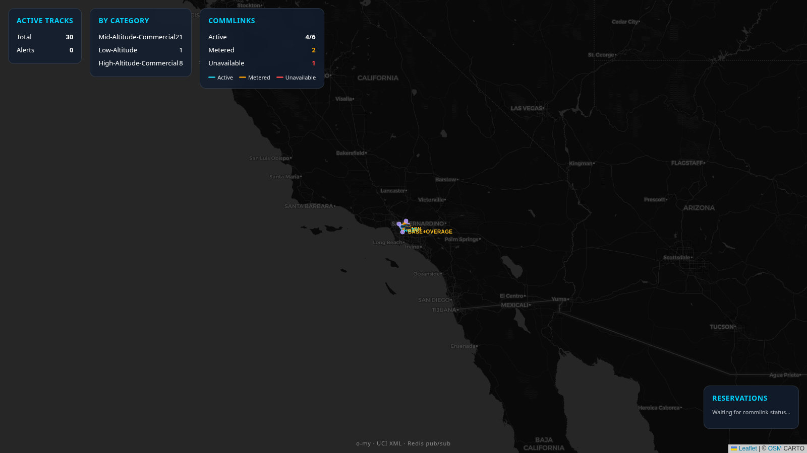

### Run locally

**Fastest (memory bus, no Redis/Docker):**

```bash
cd ../o-my
python3 scripts/run-demo-with-commlink.py   # API :8003
cd services/entity-display/web && npm run build
VITE_API_URL=http://127.0.0.1:8003 npm run preview -- --port 8080
```

**Or use the helper script** (falls back to memory bus when Redis is unavailable):

```bash
cd ../o-my
./scripts/run-stack-local.sh
```

Open http://127.0.0.1:8080 — tracks stream via SSE; commlink inventory loads from `fixtures/commlink-directory-v1.1.xml`.

### API surface

| Endpoint | Purpose |
|----------|---------|
| `GET /api/tracks` | Categorized ADS-B tracks |
| `GET /api/commlinks` | Directory links + live status |
| `GET /api/stream` | SSE snapshot (tracks + commlinks) |

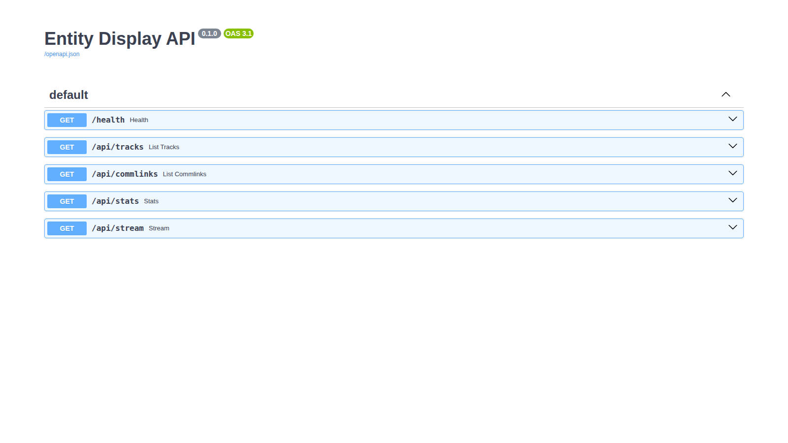

In memory-bus mode commlink data is served through the display API (`/api/commlinks`). With Redis + `commlink-status` as a separate process, the commlink service also exposes http://127.0.0.1:8004.

---

## Part 2 — o-my-sim Gulf War operator display

### What you see

Desert Storm scenario (~90 simulated minutes): battlespace map, track registry, sensor sources, CAOC tasking, F2T2EA kill chain, and BDA assess tab.

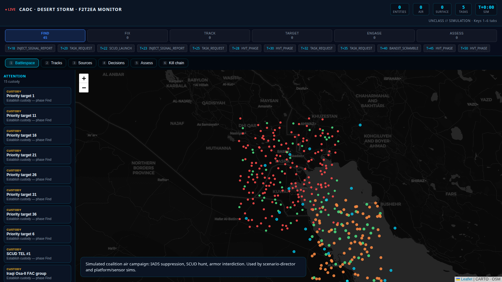

### Run locally

```bash
./scripts/demo-presentation.sh
# Live: http://127.0.0.1:8080  (API :8004)
```

Or manually:

```bash
export GULFWAR_PRESENTATION=1 ADVISOR_EMBEDDED=1
python3 scripts/run-gulfwar-local.py
cd services/battlespace-display/web && npm run dev
```

### Staged presentation sequence

| Step | Screenshot | Narrative beat |
|------|------------|----------------|
| ATO / decisions | 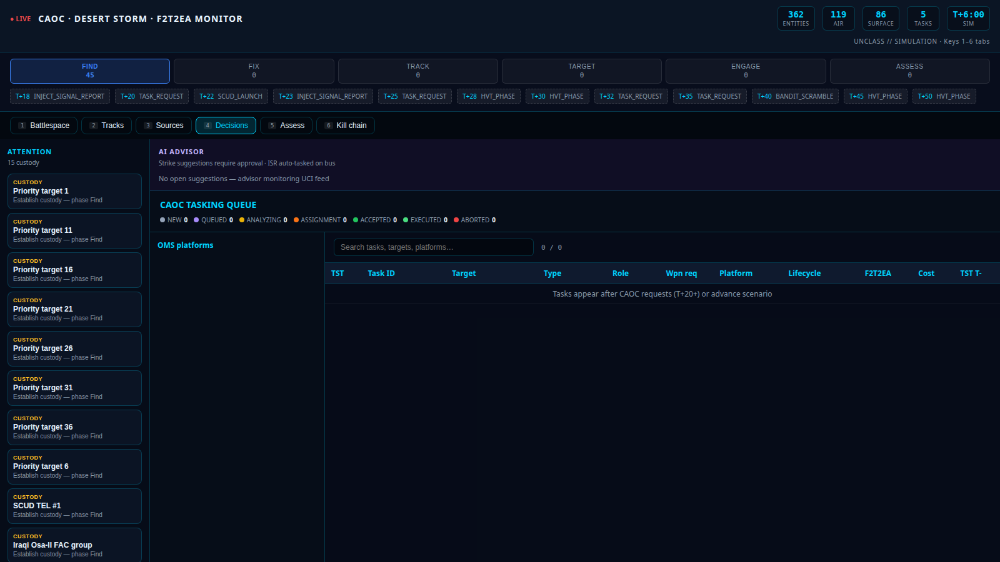 | T+0 air tasking order |
| Mission advisor | 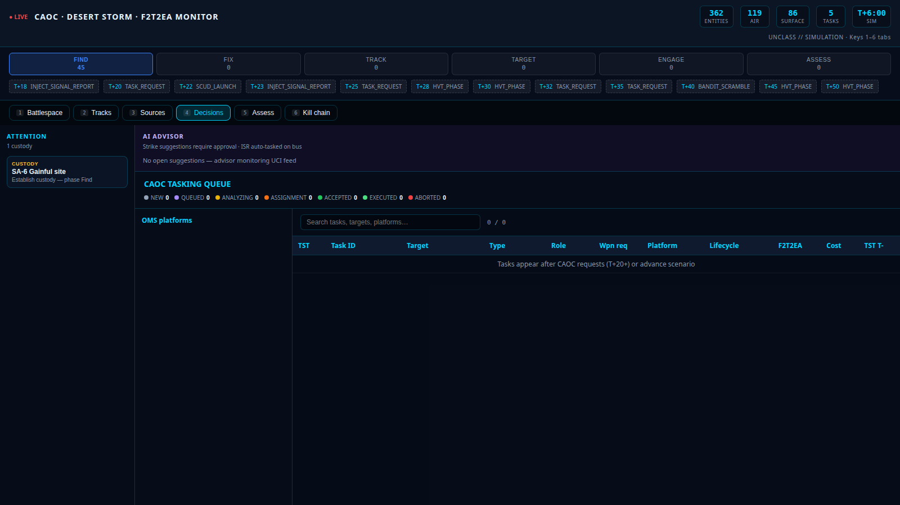 | Rule-based suggestions |
| Battlespace | 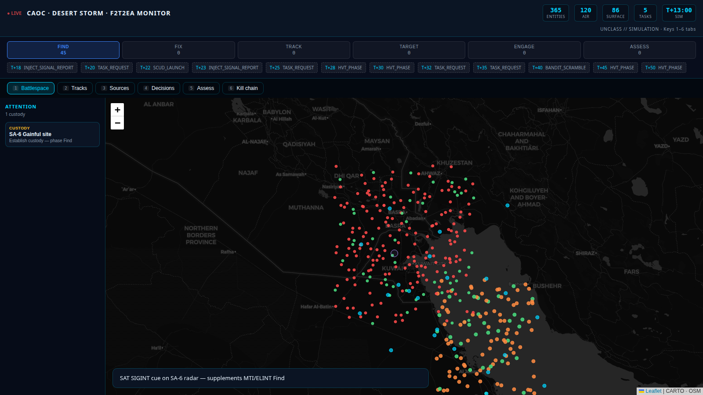 | Early picture |
| Sources | 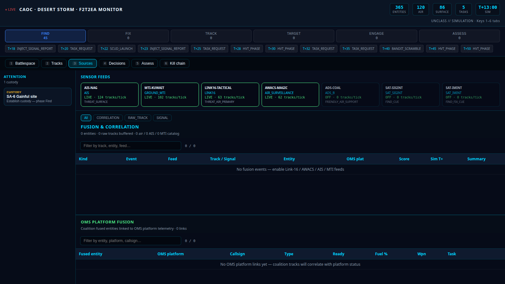 | Feeds live + OMS fusion panel |
| Tracks | 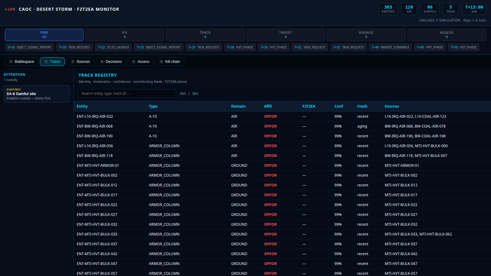 | Correlated registry |
| Kill chain | 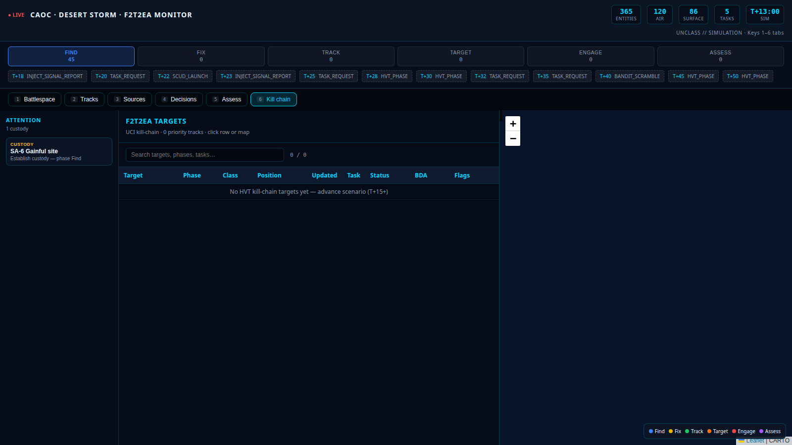 | SA-6 FIND phase |
| Tasking | 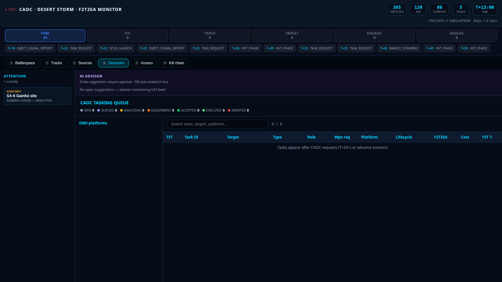 | SEAD queue |
| Assess | 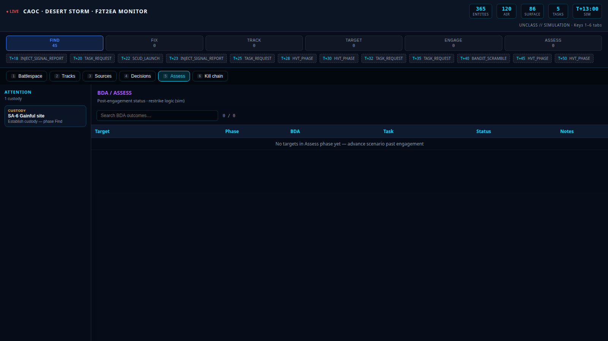 | Battle damage assessment |

Full tab set also in `docs/images/gulfwar-*.png`.

---

## Part 3 — Commlink bridge (o-my → o-my-sim)

When running the **microservice stack**, o-my-sim consumes the same commlink topics the base service publishes:

```bash
docker compose -f docker-compose.gulfwar.yml up redis commlink-status platform-status-sim
```

Flow:

1. `commlink-status` (from o-my contract) loads Directory XML and publishes `uci.commlink.inventory`, `uci.commlink.status`, `uci.commlink.reservation`.
2. `platform-status-sim` subscribes via `PlatformCommState` and merges comm subsystems into `PlatformStatusReport`.
3. `task-allocator` applies comm readiness gates (`comm_unavailable`, `satcom_degraded`).
4. Battlespace **Tasking** panel shows comm subsystem badges.

Mapping fixture: [`fixtures/commlink_platform_mapping.json`](../fixtures/commlink_platform_mapping.json).

---

## Part 4 — Feed fusion CLI (OMS-UCI-SIM preview)

Offline pipeline: multi-source feeds → correlation engine → OMS platform link.

```bash
python3 scripts/run-feed-fusion-demo.py
# or
PYTHONPATH=packages/uci_common/src:packages/oms_uci_sim/src \
  python3 -m oms_uci_sim.cli fuse-demo
```

Sample output is captured in [`05-feed-fusion-output.txt`](images/walkthrough/05-feed-fusion-output.txt). See [FEED-FUSION-DEMO.md](FEED-FUSION-DEMO.md).

---

## Quick reference

| Goal | Command | URL |
|------|---------|-----|
| o-my demo | `../o-my/scripts/run-stack-local.sh` | http://127.0.0.1:8080 |
| o-my-sim demo | `./scripts/demo-presentation.sh` | http://127.0.0.1:8080 |
| Full walkthrough + screenshots | `./scripts/capture-o-my-walkthrough.sh` | (writes to `docs/images/walkthrough/`) |
| Feed fusion | `python3 scripts/run-feed-fusion-demo.py` | CLI only |
| Next beads task | `bd ready` | — |

---

## Related docs

| Doc | Purpose |
|-----|---------|
| [COMMLINK-OMS-INTEGRATION-ROADMAP.md](COMMLINK-OMS-INTEGRATION-ROADMAP.md) | Commlink Phases 1–5 |
| [OMS-UCI-SIM-ROADMAP.md](OMS-UCI-SIM-ROADMAP.md) | Retribution + Open Arsenal program |
| [GULF_WAR_SCENARIO.md](GULF_WAR_SCENARIO.md) | Operator narrative |
| [o-my `docs/COMMLINK-SEQUENCE.md`](../../o-my/docs/COMMLINK-SEQUENCE.md) | Commlink message sequence |
