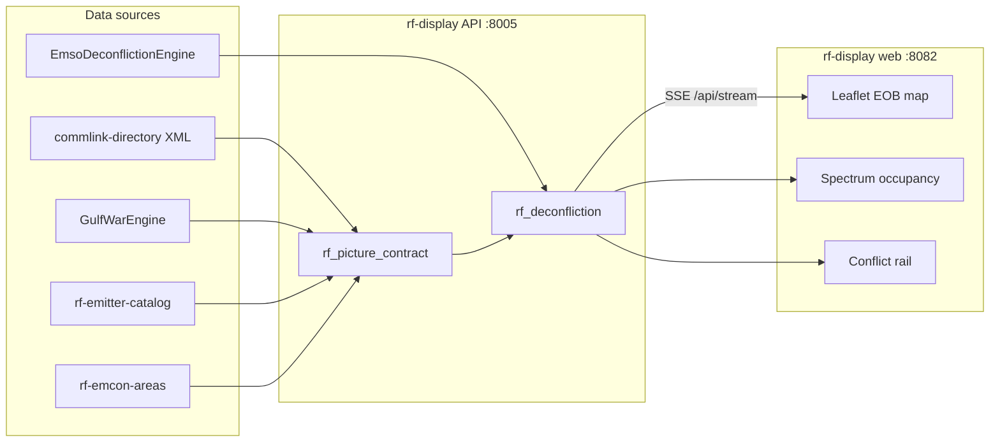

# RF Display — design and research synthesis

Third operational display for **battlespace-manager**, focused on electromagnetic spectrum operations (EMSO). Combines comm links, threat radars, OMS platform jamming capabilities, and EMCON areas into a single deconfliction-oriented picture.

| Display | Port (UI / API) | Focus |
|---------|-----------------|-------|
| entity-display | 8080 / 8003 | C2 map, tracks, commlink billing |
| battlespace-display | 8081 / 8004 | F2T2EA kill chain, tasking |
| **rf-display** | **8082 / 8005** | **Spectrum, EOB, jam/comms deconfliction** |

## Research: how industry deconflicts jamming and comms

### EWPMT / EWPMT-X (Army / USMC)

Raytheon's **Electronic Warfare Planning and Management Tool** established the dominant tactical pattern:

1. **Geospatial emitter map** — friendly and hostile emitters with propagation envelopes
2. **Spectrum occupancy view** — what is radiating, on what frequencies, where jamming would land
3. **Physics-based propagation** — terrain-aware range rings (hills block transmissions)
4. **Deconfliction automation** — Capability Drop 2+ explicitly targets *friendly-on-friendly* accidental jamming

Key operator questions EWPMT answers:

- What can be jammed? What is being jammed?
- What friendly emissions would collateral-damage a comm net?
- What does the enemy emitter look like for planning around it?

EWPMT-X migrates these capabilities onto **TAK** for joint/mobile convergence — same mental model, modular microservices.

### EMBM-J (Joint / DISA)

**Electromagnetic Battle Management – Joint** sits at operational/strategic level (vs EWPMT's tactical brigade focus):

- Cloud platform integrating service EMS capabilities into one visualization
- Phase 1: **situational awareness** (where is congestion, where is adversary jamming)
- Phase 2: **decision support** (plan and direct spectrum operations)

EMBM-J complements rather than replaces EWPMT — joint HQ sees the theater EMS picture; tactical EWO executes.

### Doctrine anchors (JP 3-85, JDN 3-16, JP 6-01)

| Concept | Deconfliction role |
|---------|-------------------|
| **JRFL** (Joint Restricted Frequency List) | Protect critical freqs from friendly EA |
| **EACA** (Electromagnetic Attack Control Authority) | Who may direct jamming fires |
| **EMCON** | Selective emission control — reduce detectability, shape deception |
| **EOB** (Electronic Order of Battle) | Inventory of emitters: freq, waveform, location, platform |
| **JEMSMO** | Deconflict comms, sensors, and fires across components |

### Display patterns for deconfliction

From EWPMT, EMBM-J, and Army EOB exercise requirements (IEW World Conference 2023):

| View | Purpose | Deconfliction use |
|------|---------|-----------------|
| **EOB map overlay** | Emitters on COP with MIL-STD-2525 symbology | Spatial: "jammer here affects comm link there" |
| **Frequency waterfall / occupancy bar** | Band usage over time or snapshot | Spectral: overlapping occupants on same MHz |
| **Jam envelope circles** | Standoff jammer coverage (EF-111, Growler) | Range: collateral to friendly datalinks |
| **EMCON polygon overlay** | Restricted emission zones | Policy: no radar / no active jam inside area |
| **Conflict queue rail** | Sorted violations with recommendations | Action: shift reservation, change band, cease emission |
| **COA simulation panel** | Model jam effect before execution | Planning: preview friendly EMI |

### Jam ↔ comms deconfliction

Primary failure mode in exercises: **friendly EA overlaps friendly comm frequency/time**.

Detection logic (mirrored in `rf_deconfliction.py`):

1. Compare jammer center frequency ± bandwidth against each active commlink
2. Flag `jam_comm` when bands overlap (with guard margin)
3. Recommend: shift jam band, reassign comm frequency, or time-slice reservation

o-my's **emso-deconfliction** service handles reservation/time overlaps; rf-display surfaces those as `reservation_conflict` alongside spectral overlaps.

### Jam ↔ radar threat deconfliction

Distinct from comms — here the operator is confirming **intentional EA** against a hostile emitter:

1. Match jammer band to threat radar catalog entry (SA-6 fire control, etc.)
2. Flag `jam_radar` as medium severity — verify EACA authority and JRFL
3. Cross-check: does jamming reveal friendly position? EMCON posture?

SIGINT cues (`uci.signal.report`) feed threat emitter positions; Gulf War scenario injects SA-6 radar cues at T+12.

### EMCON integration

EMCON is not just "radio silence" — it is **graded emission postures** (Alpha/Bravo/Charlie) with specific restrictions:

- `no_radar` — acquisition/fire-control emissions prohibited
- `no_active_jam` — EA requires coordination before activation
- `jam_requires_coordination` — EW corridor where jamming is authorized but must deconflict comms

rf-display renders EMCON areas as dashed polygons; emitters inside violating restrictions generate `emcon_violation` conflicts.

## rf-display architecture



### Picture contract (`/api/picture`, `/api/stream`)

| Key | Content |
|-----|---------|
| `commlinks` | Directory + live status, enriched with `frequency_mhz` / band |
| `emitters` | Threat radars from SIGINT cues + OPFOR entities |
| `ew_platforms` | Coalition EW assets (EF-111) with jam envelopes |
| `emcon_areas` | Polygon restrictions from fixture |
| `spectrum` | Occupancy rows with `contested` flag |
| `conflicts` | `jam_comm`, `jam_radar`, `emcon_violation`, `reservation_conflict` |
| `deconfliction_summary` | Counts by severity and type |

### Fixtures

- `fixtures/rf-emitter-catalog-v1.json` — emitter type → frequency, bandwidth, class
- `fixtures/rf-emcon-areas-v1.json` — EMCON polygons for Gulf War AO
- Reuses `fixtures/commlink-directory-v1.1.xml` for comm frequencies

## Quick start

```bash
# Terminal 1 — API with embedded Gulf War engine
python3 scripts/run-rf-display-local.py

# Terminal 2 — UI
./scripts/run-rf-display-ui.sh
# → http://localhost:8082
```

Docker:

```bash
./scripts/prepare-docker-vendor.sh
docker compose up --build rf-display-api rf-display-web
```

## Future phases

| Phase | Enhancement |
|-------|-------------|
| 1 | Terrain-aware propagation (FSPL + terrain mask) |
| 2 | Live Redis bus from o-my `emso-deconfliction` + `spectrum-ops-analytics` |
| 3 | JRFL overlay — protected frequency list with EA authority gates |
| 4 | COA preview — toggle jammer on/off and diff conflict queue |
| 5 | Link to battlespace-display tasking — SEAD task auto-highlights target radar |

## References

- AFDP 3-85 — Electromagnetic Spectrum Operations
- JDN 3-16 — Joint Electromagnetic Spectrum Operations
- JP 6-01 — Joint Electromagnetic Spectrum Management Operations
- EWPMT Capability Drops 1–4 (Raytheon / Army PEO IEW&S)
- EMBM-J MVP (DISA, 2023)
- IEW World Conference 2023 — EOB overlay requirements paper
