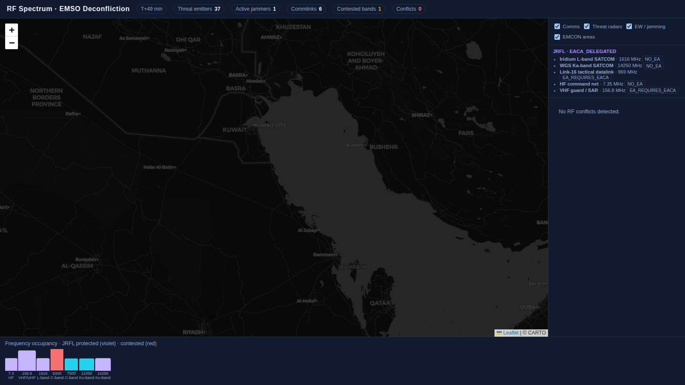

# RF Display — operator walkthrough

Step-by-step EMSO deconfliction workflow using **rf-display** (`:8082`) with optional cross-link from **battlespace-display** (`:8081`).

Screenshots: [`docs/images/rf-walkthrough/`](images/rf-walkthrough/)

## Prerequisites

```bash
# Sibling repos
repo/o-my/
repo/o-my-sim/
repo/battlespace-manager/

# Capture walkthrough (starts API + UI, advances sim, screenshots)
./scripts/capture-rf-walkthrough.sh
```

Manual run:

```bash
python3 scripts/run-rf-display-local.py   # :8005
./scripts/run-rf-display-ui.sh            # :8082
```

## Workflow

### 1. RF spectrum overview

Open http://localhost:8082

The header rail shows:

| Stat | Meaning |
|------|---------|
| Threat emitters | Hostile radars from SIGINT cues + OPFOR tracks |
| Active jammers | Coalition EW platforms with SEAD/EW_SUPPORT tasking |
| Contested bands | Frequency rows where jammer + comm or multi-affiliation overlap |
| Conflicts | Deconfliction queue count |



**Map layers** (toggle in sidebar):

- **Comms** — cyan polylines from commlink directory frequencies
- **Threat radars** — red markers (SA-6 fire control after T+12 SIGINT cue)
- **EW / jamming** — amber platform + FSPL-derived envelope circle
- **EMCON areas** — purple dashed polygons (strike package, tanker orbit, EW corridor)

**Spectrum bar** (bottom): occupancy by MHz; violet = JRFL protected, red = contested.

### 2. Deconfliction conflict rail

The right sidebar lists conflicts sorted by severity:

| Type | When |
|------|------|
| `jam_comm` | Friendly jam band overlaps active commlink |
| `jam_radar` | Jam engages hostile radar — verify EACA / JRFL |
| `jrfl_violation` | Jam threatens JRFL-protected frequency |
| `emcon_violation` | Emitter active inside restricted EMCON polygon |
| `reservation_conflict` | Overlapping commlink reservations (o-my EMSO bus) |

Each card shows recommendation text (e.g. `shift_jam_band_or_reassign_comm_frequency`).

### 3. JRFL overlay

JRFL entries appear in the sidebar below layer toggles:

- Protected frequencies (SATCOM L/Ka, Link-16, HF command)
- Restriction class: `NO_EA` or `EA_REQUIRES_EACA`
- EA authority holder from fixture (`EACA_DELEGATED` → RAVEN01 package commander)

Spectrum bars matching JRFL frequencies render in violet.

### 4. FSPL jam envelopes

EF-111 (`RAVEN01`) jam coverage uses **free-space path loss** with terrain mask:

- High altitude → larger effective envelope
- Tooltip shows `coverage_nm (FSPL)` on map
- `ew_platforms[].effective_coverage_nm` in `/api/picture`

### 5. Battlespace cross-link (SEAD → RF highlight)

From battlespace-display **Tasking** tab, expand a **SEAD** task (e.g. SA-6 Gainful site):

**RF spectrum · highlight SA-6 Gainful site** → opens rf-display with `?highlight=HVT-SA6-01`

The threat emitter pulses yellow/white on the RF map; `/api/highlight` POST syncs selection.


### 6. Live Redis bus (optional)

When `REDIS_URL` points to o-my Redis (not `memory://`):

- Subscribes to `uci.commlink.*`, `uci.emso.conflict`, `uci.analytics.spectrum`
- Header shows **Redis bus live**
- Conflicts and spectrum utilization merge from `emso-deconfliction` + `spectrum-ops-analytics`

```bash
# With o-my stack running:
REDIS_URL=redis://localhost:6379/0 python3 scripts/run-rf-display-local.py
```

## API contract

`GET /api/picture` and `GET /api/stream` return:

```json
{
  "sim_minutes": 12,
  "emitters": [...],
  "ew_platforms": [{ "coverage_nm": 85.2, "terrain_mask_factor": 1.0 }],
  "jrfl": { "entries": [...], "ea_authority": {...} },
  "highlight_entity_id": "HVT-SA6-01",
  "bus_connected": false,
  "conflicts": [...],
  "deconfliction_summary": { "by_type": { "jam_radar": 1 } }
}
```

Highlight control:

```bash
curl -X POST http://localhost:8005/api/highlight \
  -H 'Content-Type: application/json' \
  -d '{"entity_id":"HVT-SA6-01"}'
```

## Related docs

- [RF-DISPLAY-DESIGN.md](RF-DISPLAY-DESIGN.md) — research synthesis and architecture
- [COP-OPERATOR-WORKFLOW.md](COP-OPERATOR-WORKFLOW.md) — battlespace F2T2EA flow
