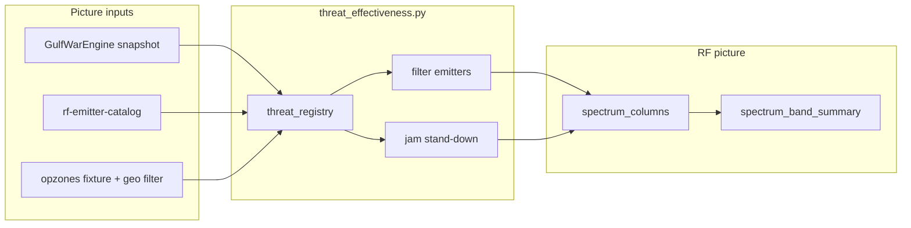

# RF threat effectiveness — build plan

Fuse **frequency**, **F2T2EA phase**, **BDA outcome**, and **opzone applicability** so operators see which threats radiate in each ITU band, and jammers stand down when BDA suppresses targets in the selected region.

## Problem

| Symptom | Root cause |
|---------|------------|
| Jammer TX after target destroyed | RF ignores `bda_status`; `jamming_active` follows task role only |
| Can't see threat × frequency × phase | Battlespace FKCM and RF spectrum are separate pictures |
| Region filter only on RF | Geo-filter is local HTTP state; no shared opzone / UCI applicability |

## Target operator flow

1. Select **opzone** (e.g. CAOC AOR Kuwait) — all displays scope to that polygon.
2. **ITU band overview** shows active threats per band with F2T2EA phase + BDA badge.
3. Select band → interactions → horizontal device drill-down (existing).
4. When BDA = **Destroyed** / **Damaged**, threat drops from band; jammer goes **STBY** if no remaining targets in band+opzone.

## Architecture



## Phases

### Phase 1 — Engine/harness path (this PR)

- [x] `threat_effectiveness.py` — registry, BDA suppression, jam stand-down
- [x] `fixtures/opzones-v1.json` — preset operational zones
- [x] `GET /api/opzones`, `POST /api/opzone/select` — opzone → geo_filter
- [x] Harness `threat_registry` overrides for deterministic BDA demo
- [x] `spectrum_band_summary.threat_occupants` with phase/BDA
- [x] UI: band cards show suppressed count; drill-down shows STBY jammers
- [x] Tests: `test_threat_effectiveness.py`, harness verify check

### Phase 2 — Battlespace cross-link

- [ ] Battlespace picture adds `threat_registry` (shared builder)
- [ ] Kill-chain row → RF band deep link `?band=uhf&highlight=entity`
- [ ] Assess tab filter: show only active vs suppressed threats

### Phase 3 — UCI bus mode

- [ ] Subscribe `uci.target.status` (bda-assessor) on RF + battlespace bus picture
- [ ] Subscribe `uci.killchain.state` / `uci.f2t2ea.state` for phase
- [ ] Publish `uci.display.opzone` for shared applicability (replace local-only geo)

### Phase 4 — Live intel

- [ ] Emitter frequencies from SIGINT bus vs static catalog
- [ ] Spectrogram behind drill-down (`battlespace-manager-yjb`)

## Data contracts

### `threat_registry[]`

```json
{
  "entity_id": "HVT-SA6-01",
  "label": "SA-6 FC radar",
  "platform_type": "SA-6_FIRE_CONTROL_RADAR",
  "frequency_mhz": 5400,
  "band_id": "shf",
  "f2t2ea_phase": "Target",
  "bda_status": null,
  "effective_status": "active",
  "latitude": 28.45,
  "longitude": 48.35,
  "in_opzone": true
}
```

`effective_status`: `active` | `suppressed` (BDA Destroyed/Damaged) | `out_of_opzone`

### BDA suppression rule

```python
SUPPRESSED_BDA = {"destroyed", "damaged"}
```

Tune per doctrine via env `RF_BDA_SUPPRESS_STATUSES=destroyed,damaged`.

### Jam stand-down rule

After emitter filter: if jammer `jamming_active` and no remaining **active** emitter overlaps its band → `jamming_active=false`, `jam_standdown_reason=no_active_threats`.

## Acceptance (Phase 1 harness)

1. Harness with one threat `Destroyed` in registry → only one SA-6 radar in SHF band.
2. EF-111 jam at L-band → STBY when SATCOM-only overlap and threat suppressed (or no radar overlap).
3. `POST /api/opzone/select` with Kuwait AOR → threats outside polygon `out_of_opzone`, hidden from bands.
4. `GET /api/harness/verify` includes `threat_effectiveness` check.

## Files

| Area | Path |
|------|------|
| Core | `services/rf-display/api/app/threat_effectiveness.py` |
| Picture | `services/rf-display/api/app/rf_picture_contract.py` |
| Bands | `services/rf-display/api/app/rf_bands.py` |
| API | `services/rf-display/api/app/main.py` |
| Fixtures | `fixtures/opzones-v1.json`, `fixtures/rf-harness-scenario-v1.json` |
| UI | `SpectrumBandOverview.svelte`, `InteractionDrilldown.svelte` |
| Tests | `api/tests/test_threat_effectiveness.py` |
